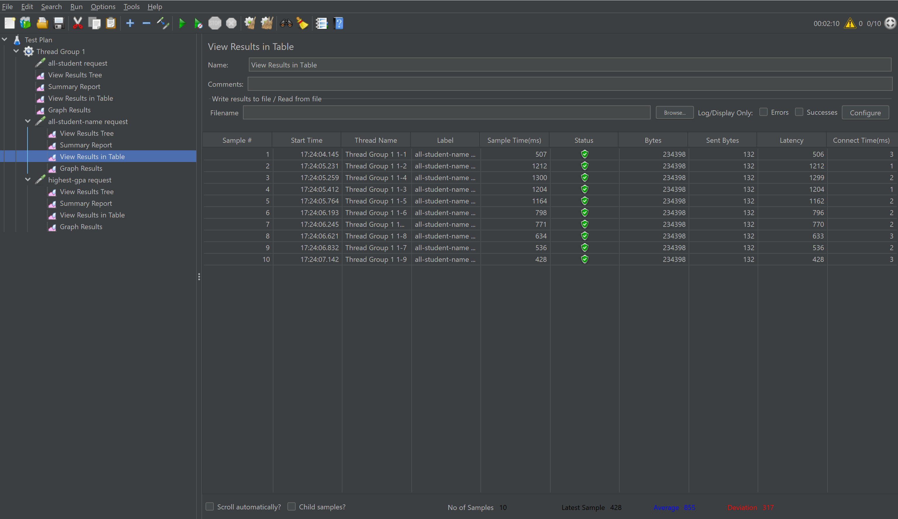
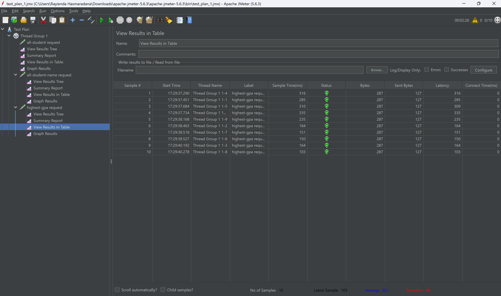
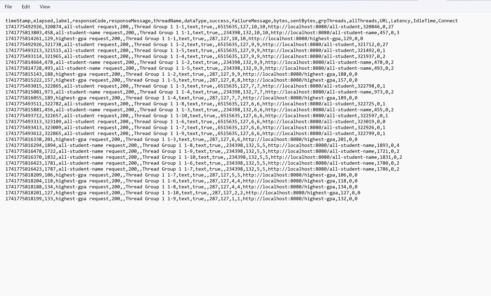
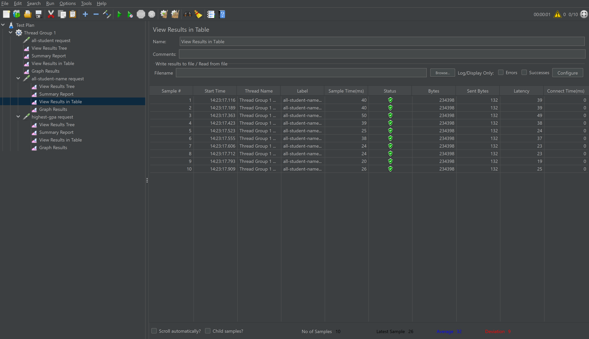
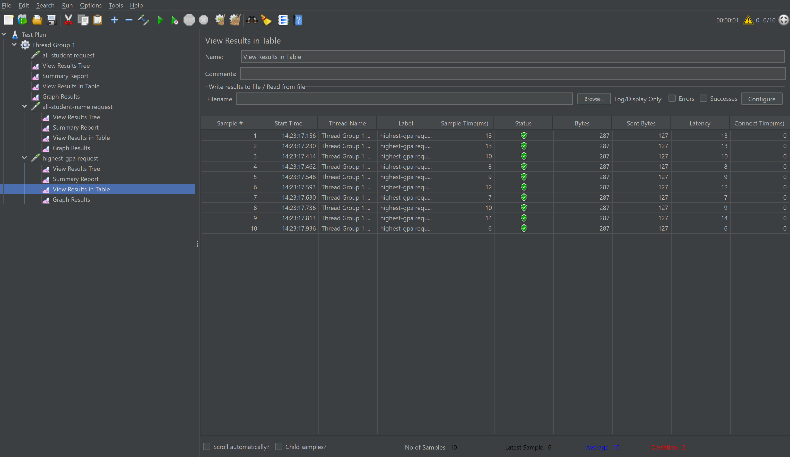
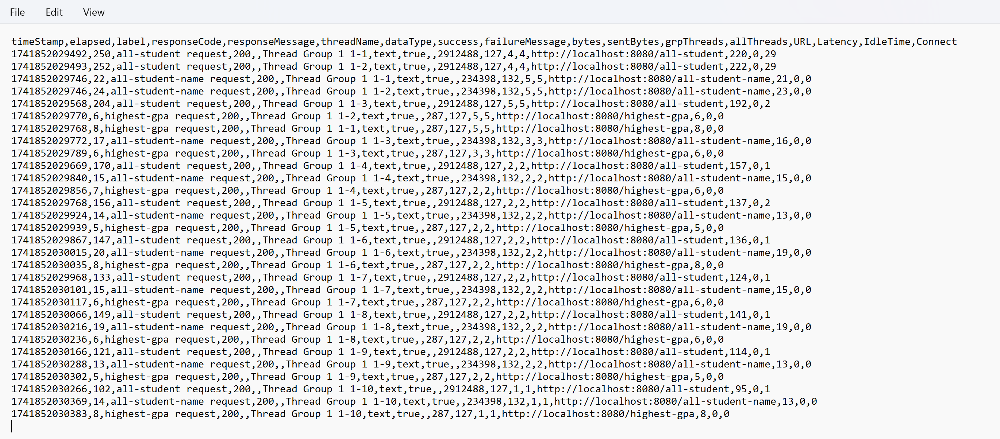

### Rayienda Hasmaradana Najlamahsa - 2306172735

### JMeter before the optimization

#### Command line before

### JMeter after the optimization

#### Command line after

### Reflection

1. ##### Difference between JMeter and IntelliJ Profiler for optimization?
   - JMeter is used for performance testing by simulating real-world load on the application. It helps evaluate the system’s scalability, response times, and throughput under various traffic conditions, which is essential for understanding how the application performs under stress.
   - IntelliJ Profiler, on the other hand, is used for profiling the application at the code level. It provides insights into CPU usage, memory consumption, method execution times, and thread activity, helping identify specific bottlenecks or inefficiencies in the application code.
2. ##### How does profiling help identify weak points in the app?
   Profiling gives detailed insights into where the application consumes resources, revealing areas like slow methods, excessive CPU usage, memory leaks, and inefficient thread management. By pinpointing these weak points, developers can focus on optimizing the most critical parts of the application that are affecting performance.

3. ##### Is IntelliJ Profiler effective in identifying bottlenecks?
   Yes, IntelliJ Profiler is very effective at identifying performance bottlenecks. It provides data on method execution times, memory allocations, and thread usage, which allows developers to easily spot inefficient or problematic parts of the code. By analyzing these metrics, you can find and address issues that slow down the application.

4. ##### Challenges with performance testing and profiling?
   - Challenges: Performance testing with JMeter can sometimes fail to replicate real-world usage patterns, and profiling can produce a lot of data, making it difficult to identify the most relevant issues. Additionally, differences in environments (e.g., production vs. testing) can lead to inconsistent results.
   - Solutions: To overcome this, use staging environments that closely mimic production, focus on key metrics during profiling, and ensure that JMeter tests reflect realistic user behavior and traffic patterns.

5. ##### Benefits of using IntelliJ Profiler?
   The main benefits of using IntelliJ Profiler are:

- Identifying performance bottlenecks such as slow methods, excessive memory usage, and inefficient threading.
- Helping you optimize CPU and memory usage by providing clear insights into resource consumption.
- Improving application efficiency, leading to faster response times, reduced load on the system, and a better overall user experience.

6. ##### How to handle inconsistencies between profiling and JMeter results?
   If profiling results are inconsistent with JMeter performance testing, it's important to cross-reference both sets of data. Profiling looks at the application’s internal code execution, while JMeter simulates external load, so the bottlenecks found might differ. Ensure that the environments for both tests match as closely as possible and try to replicate realistic user behavior in JMeter to get more accurate results.

7. ##### Optimization strategies and ensuring no functional impact?
   After identifying bottlenecks, strategies include:

- Refactoring inefficient methods, optimizing database queries, and reducing memory usage.
- To ensure no functionality is impacted, use automated unit tests, perform code reviews, and test optimizations in a staging environment before deployment.
- Implementing feature flags allows testing optimizations with a subset of users in production, ensuring changes don’t break functionality.

    These strategies help ensure that optimizations improve performance without affecting the application's stability or features.